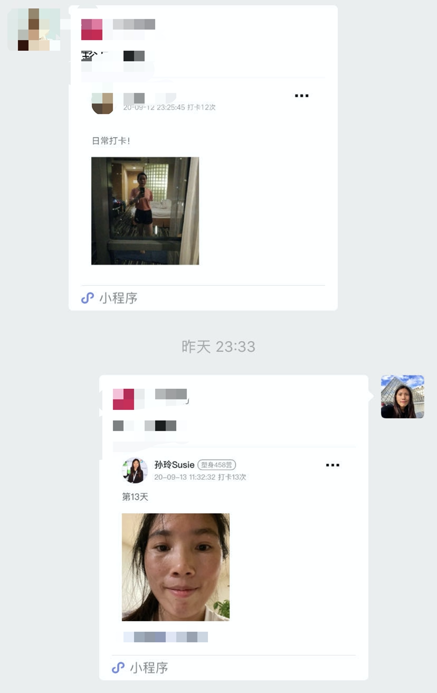

朋友之间，就应该经常联系，最好是，可以找一件事情一起来做。其实几个好友不一定得在同一个地方才能去创造一些共同经历。因为我们想要做的事情，个人可以线下做，线上分享。我发现通过这样的共同经历，朋友之间的关系会更好，因为一直保持着联系，同时分享做事的过程可以帮助双方互相成长。尤其是对在异国他乡的我，更是好处多多。

分享几件最近我和朋友正在坚持的一些事情。

### 一起读书
我有跟几个好友在读同一本书，每周视频会议讨论书中的内容，有天突然有个灵感，我可以利用我公众号接的广告费来赞助开办一个只属于我们的读书俱乐部，希望这个想法可以被落地。

### 一起运动
我有跟一个好朋友在坚持运动打卡活动，每天15分钟。意外的是，我室友也非常感兴趣，所以每天晚上我室友跟我不约而同的会一起运动。

### 一起刷题
我有跟一个好朋友从周一到周五在坚持算法题模拟面试，每次1个小时，每人半个小时，双方给对对方出一道题。现在我们已经坚持了快20天了，很享受每天的1个小时，不想停下来。我们不会拘泥于任何形式，虽然不能算是模拟面试，但是可以来帮助我们拓展和巩固刷题思路。

### 一起听播客
我有跟几个微信好友在听播客上同一个频道里的内容，我会将音频和对应的脚本分享在小群，每周精听一期节目，周末视频来分享内容，顺带学习英语。

如果你想跟你朋友一起做一件事情，那会是什么呢？

