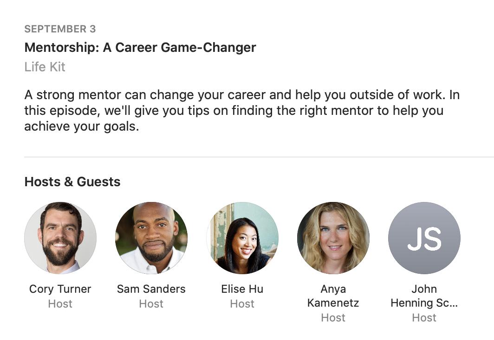

下面是我听Life Kit这期节目录做的一些笔记，跟大家分享。

# The Right Mentor Can Change Your Career. Here's How to Find One
1. Takeaway No. 1 - write down your goals.
2. Takeaway No. 2 - also write down potential mentors in your existing network.
3. Takeaway No. 3 - once you're ready to make it official, make a clear ask of the mentor.
4. Takeaway No. 4 - remember that it's OK to have more than one mentor.
5. Takeaway No. 5 - mentees, be open to feedback and do the homework between sessions.
6. Takeaway No. 6 - you can be mentored or become a mentor at any age.

> And so he encouraged me to try again, navigating the working world as a young person and as a person who really didn't feel like I had a place there and feeling all the things -**imposter syndrome**.

Impostor syndrome (also known as impostor phenomenon, impostorism, fraud syndrome or the impostor experience) is a psychological pattern in which an individual doubts their accomplishments or talents and has a persistent internalized fear of being exposed as a "fraud".
冒名顶替症候群或者骗子症候群。这个名称是在1978年由临床心理学家Pauline R. Clance与Suzanne A. Imes所提出，用以指称出现在成功人士身上的一种现象。患有冒名顶替症候群的人无法将自己的成功归因于自己的能力，并总是担心有朝一日会被他人识破自己其实是骗子这件事。他们坚信自己的成功并非源于自己的努力或能力，而是凭借著运气、良好的时机，或别人误以为他们能力很强、很聪明，才导致他们的成功 。即使现实环境中的证据指明，他们确实具备优秀才能，他们还是认为自己只是骗子，不值得获得成功。有研究显示，冒名顶替症候群在高成就女性当中较为常见 ；同时也有研究指出男性与女性的盛行率没有差异

> I'm a producer at NPR and one of the cofounders of the **Marginalized** Genders and Intersex People of Color mentorship program here.

marginalized 边缘化 groups 

> I live alone, and debating whether to go stay with my dad and what that would **entail**. And, yeah, it is a tough time. How about you?

entail 意味着...

> Yeah, same. It's kind of - we just **take for granted being** able to go anywhere at any time.

学习这个表达，take for granted doing/being 将某事当做理所当然

> Honestly, exercise is the thing that's keeping me **sane** right now.

sane  神志正常的 it's the only thing that keeps me sane 这是唯一不让我发疯的事

>Mentorship is a **reciprocal** relationship that's a partnership, where **mentor** and **mentee** focus on mutually defined goals that advance a mentee's skills, abilities or competencies.

reciprocal  /rəˈsiprək(ə)l/ 互惠的
mentor and mentee
trainer and trainee 你还能想到什么

> First of all, that's - that can be really **off-putting**. And second of all, it can be a little creepy.

off-putting 令人讨厌的

> I've gotten that **cold** LinkedIn email, too.

cold 尴尬的 

> You're ready to **take the plunge** and make it official. We've arrived at takeaway No. 3 - popping the question.

take the plunge 冒险

>If you're a minority or a person of color or identify as nonbinary or another marginalized identity, you can and should seek out a mentor you can talk to you about complicated issues like racism in the workplace, harassment, discrimination, **gaslighting**, all kinds of microaggressions. Sometimes these identity-based mentors - they just get it.

 *gaslighting* : manipulate (someone) by psychological means into questioning their own sanity.
煤气灯效应是一种心理操纵的形式，其方法是一个人或一个团体隐秘地让受害人逐渐开始怀疑自己，使他们质疑自己的记忆力，感知力或判断力，其结果是导致受害者的认知失调和其他变化，例如低下的自我尊重。因为其使用否定，误导，矛盾和错误信息，煤气灯效应使受害者心理上去稳定化以及使受害者不再相信她/他们原来的的信仰。在现实案例中的范围，可以从虐待者否认先前发生过虐待事件，到虐待者意图使受害者迷失方向的怪异事件的发生。

> We've heard from dozens of participants that just having a space to **vent** and share ideas among people with a common identity

vent 宣泄 发泄

> You know, here's the biggest **misnomer** - **misconception** in mentoring relationships. It's that the mentor drives the relationship, and that's just not true in effective mentoring relationships. Mentees need to drive.

misnomer /misconception  误解

> Mentors should have mentors. You know why? Because if you're not learning, you're **stagnant**. You're not growing. And you're really not contributing and adding the value you can add to the world.

stagnant /ˈstaɡnənt/ 呆滞的 死气沉沉的 