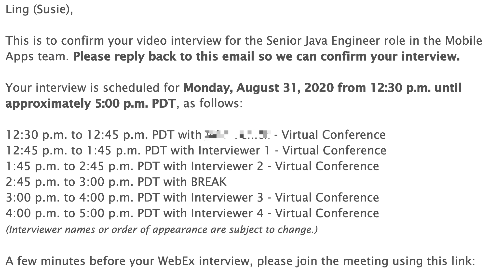

前些天有幸拿到了在美国的苹果公司一个Senior Java Engineer职位Virtual Onsite面试，昨天收到了拒信，但这个过程还是挺有收获的。那到底什么是Virtual Onsite面试呢？

首先了解下什么是onsite面试，An onsite interview is that phase of the interview process that occurs at the company site.
很多美国大公司的onsite面试都是一整天，上午跟人聊聊，中午在公司的食堂跟人边吃边聊，下午再跟一些人聊聊之类的。

因为疫情，Onsite面试全部成了virtual，线上进行。题外话，这两个字放在一起就有点滑稽对不对，onsite是到现场意思，virtual是虚拟的，完全相反的意思。Anyway，这个面试就是一个需要花一大半天才能完成的面试。

我这种大面试的经历比较少，这个是我第二次进行。整体来说，这是一个很烧脑的过程，并且神经会处于高度紧绷的状态。因为我的岗位是偏技术，面试的大部分内容还是围绕着我的编码能力、解决问题能力和我过去的工作经历中使用了什么技术解决了什么问题有关。

其中有一轮面试，我是完全处于大脑空白的状态，面试官给我一些思路，我也没有能力进行思考更多，所以面挂是必然。

但经过这次面试，我知道自己缺哪些，应该知道往哪个方向去努力。

将我的拒信贴出来给大家看看。
>Thank you for contacting me. We wanted to thank you for taking the time to explore this opportunity with us but unfortunately, there was not an exact match with our team. 
>The good news is, this does not exclude you from pursuing other teams within Apple.  I shared your resume with other teams who are looking for your skill set.  If you find a position on *jobs.apple.com* that is a match for your background please send me the ID number and I am happy to present your resume to that team.  
>Thanks again for your time and consideration.

有个更好的消息是，后面苹果公司的另一个team的recruiter有联系我，问我是否有兴趣安排时间面试。

这真出乎我的意料！肯定有兴趣啊，因为这将会是另一个学习机会！

