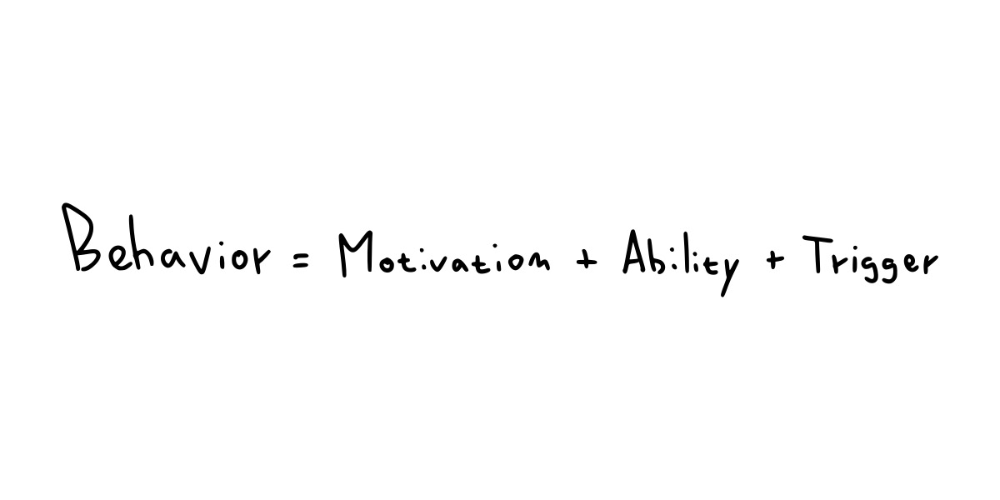
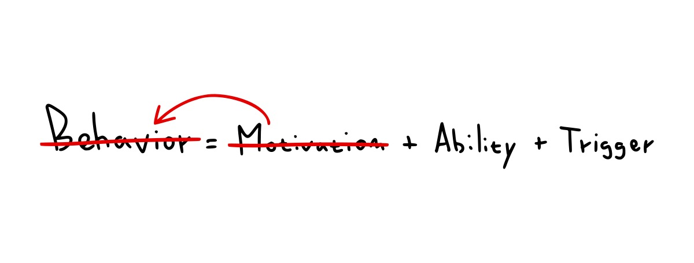
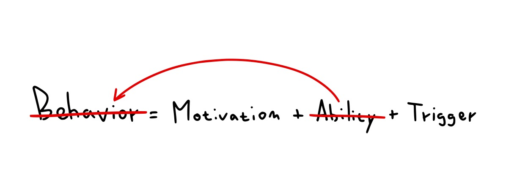
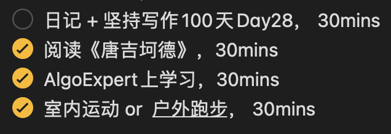
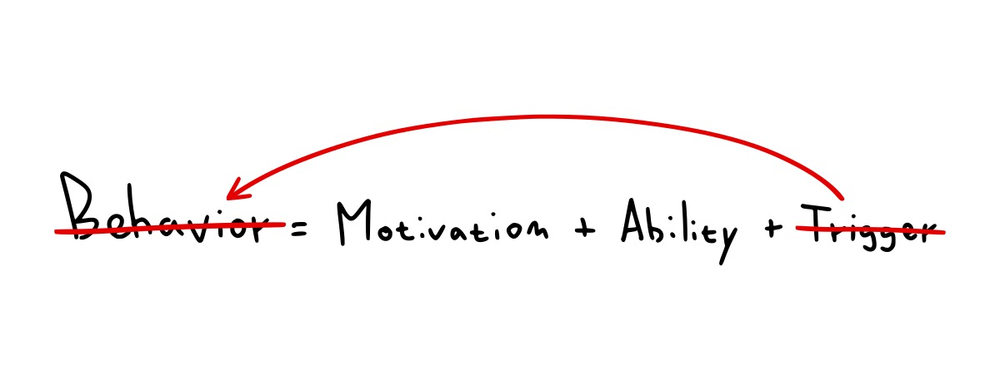
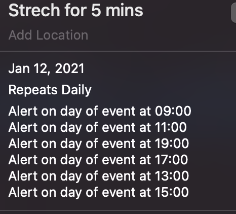

最近发现我的拖延症好严重，这两天我恰好在网站deprocrastination有看到一篇关于拖延症的文章，文章标题是《How to stop procrastinating by using the Fogg Behavior Model》。 Brian Jeffrey Fogg是斯坦福教授，他提出的行为模型可以帮助我理解和分析我的拖延症。

Fogg Behavior Model(简称FBM)公式：**行为=动机+能力+触发**。我们要想着手去做某事，动机、能力、触发这三个要素缺一不可。

### 缺少动机

有时，我们有能力去做某事，甚至有触发条件，例如事项的截止日期和待办事项等等，但是，就是没有动力着手**开始去做**。并且我发现，长大以后，自我驱动越来越难以实行。我现在的工作状态就是这样，比较被动，主动不起来，心里很焦虑，更加可怕的是，我现在不但没有找到内动力主动起来，反而慢慢适应了焦虑的状态。

那么如何帮自己重新建立动机呢？Fogg在这篇文章说
> We feel motivated when we viscerally feel how an action is **meaningful**, or **valuable** to us and when we **believe we can** take it.
> We don't feel motivated when we don't see the meaning or value hiding behind a to-do item.

他说如果我们内心能真真实实地感觉到某件事的意义和价值，并且相信我们有能力去完成，就会感到**有动力**。在一定程度上，我认同这句话背后的含义，但关键是如何找到**对的、具体的**意义和价值，然后说服自己积极起来。

我想工作的意义是可以实现我们的价值和去创造价值， 但这个意义过于宏大，不具体。我开始问自己，为什么我当初选择了这份工作？

我是为了积累工作经历，为了接触更多的资源，为了挣钱，为了提升我的合作能力。回答完这个问题后，我的思路稍微清晰了一些。

另外，我还有一个小诀窍：当我内动力不足的时候，我就会去寻找外动力。我喜欢去找志同道合的朋友跟我去做同一件事情，这样不仅可以增强关系，还可以一起学习，两全其美。

### 缺少能力

我深有体会，如果一项任务看起来特别难，我就迟迟不愿意开始去做，找各种借口开始去拖延，例如
- 坐了太久了我得站起来休息会
- 先看个视频调整下心情

心底里期待未来“厉害的自己”更加高效地去完成，即使当我开始去做了，也很容易分心，手机没有消息时，我也非常自然地拿出手机开始刷，不知不觉拖延了半个小时。这是为什么呢？

原因就是能力不够。从能力上来说，分心太不需要能力了。 所以最好的方式就是拆分任务：把大任务拆分成若干个小任务，这样就能降低整体任务的难度。例如，写一篇1000字的文章很难，我可以将任务分解成先写三段，或者先写个30分钟。 我现在每天的待办事项的模式是：做什么，做多久。

我在播客上还听到这样一个小故事：一个刚生完宝宝后的妈妈非常忙，没有时间锻炼身体，所以她开始养成一个习惯，早上六点左右宝宝在睡觉时，她早起去跑步，为了降低任务难度，她睡觉前就会穿好运动的衣服，第二天闹铃一响，就可以穿上跑鞋出门跑步了。

### 缺少触发

有时候，我们有充分的动机，也把任务拆好了，如果还会拖延，那原因就可能触发不够。那正确的做法应该就是提高任务的可见度。我的做法是利用日历来提醒，开始形成习惯了，慢慢就不需要提醒了。
 

我不相信有人生来就有着比别人更强的自律。拖延症是个**系统问题**，跟人的固有的行为模式有关系。下次当我们遇到拖延时，可以从动机、能力和触发角度去分析到底哪个环节出了问题？然后对症下药，找到方法开始行动起来。

不管做什么，先有完成，才会有完美。  

参考文献
How to stop procrastinating by using the Fogg Behavior Model ( by  B J Fogg)

