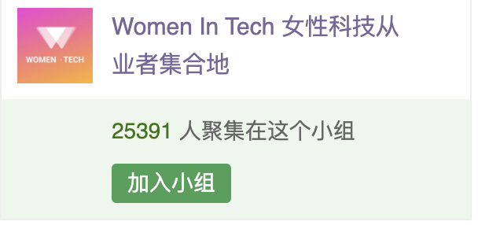

前不久收到「WomenInTech分享会」的邀请在线上过节，他们是一个什么组织呢？

> Women In Tech分享会诞生于一个寻找设计师同行的简短帖子，没想到吸引了其它各行各业网友求围观设计项目的大量回复。这个帖子很快变成了每周一次非盈利的Zoom活动，全部由志愿者无偿在业余时间组织推广，邀请科技领域各行各业的女性从业者，匿名分享她们的专业项目和经验实例，来增进不同行业、不同资历、不同国家之间职场女性的交流和学习。目前已成功吸引了千人次的观看和参与，分享内容涉及软件工程，数据科学，设计，创业，能源，制造业、职业发展等。

我很有幸被邀请作为分享嘉宾参与他们3月7号组织的活动。活动时间是** 2021年3月7号北京时间午夜0点**，参与通道有Zoom 和Clubhouse 。

我选择推送这篇文章时我犹豫了，因为大部分人都已经多多少少了解我的经历，我担心没有什么有价值的内容提供，老生常谈很没劲。 但是，再仔细想，这个活动也不是一对多的一个分享活动，是多对多的连接，多人会议而已，对我来说，这是一个机会，让我去认识不同行业不同职业人的机会，怎能错过呢？

所以，我也不想你错过。今年国际妇女节的主题是# #ChooseToChallenge. 虽然我没有大目标去挑战， 但是要答应自己尽量有多少，做多少，健康地开心地过好每一天！2021，你会挑战什么？

**活动时间**
2021.03.06 美东上午11am，美西8am
2021.03.06 伦敦下午4pm
2021.03.07 国内午夜00点

**Zoom直播链接**
关注公众号并回复“直播链接”
活动开始前进入直播间

**Clubhouse链接**
关注羡羡子俱房账号：xianxianzi
活动开始前进入羡羡子所在的房间
没有俱房的朋友也不必担心
Zoom里的内容是一样且同步的

