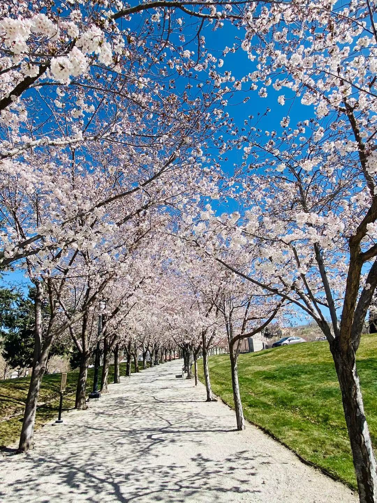
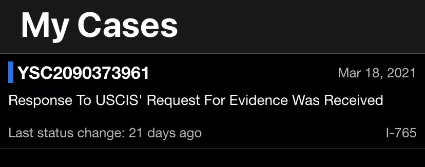
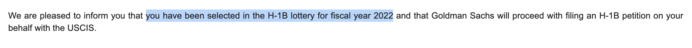

# 我被停工了
盐湖城的春天来了，花开了，叶子绿了，我被停工了。

4月1号，愚人节，2015年我曾在这天入职一家新公司，2021年我被停工，因为我没有有效的身份许可在美国工作。

### 被按暂停键
从2018年10月1号，开始我在美国的工作之旅，我用的是F1学生签证和CPT工作许可，但CPT只能有一年的期限，所以从2019年10月开始，我用OPT工作许可工作，期限也只能有一年。这两年我的雇主可以协助帮我申请H1B工作签证，但我运气不好，我都没被选中。

不过我应该还有机会抽取H1B工作签证。

因为我攻读的专业是计算机科学，属于STEM(Science, technology, engineering, and mathematics)领域，所以我可以将OPT申请延期24个月。

2020年8月份找到工作后，我就开始赶紧张罗申请OPT延期的事情。 申请延期最重要的一个资料就是培训计划，就是跟雇主是有关系的，所以找工作时要求雇主必须要支持处理OPT延期的事情。

我的OPT是9月29号之前到期，在那之前得把所有资料全部发给我的学校，学校再将资料发给USCS。差不多2个星期，我收到了USCIS的一个「收到了」的通知文件，有了这个通知文件，我才能在OPT到期后可以合法工作。 

因为我2020年11月份换了雇主，培训计划得跟最新的雇主，所以又是一番表单的填写和更新。 

这个OPT延期申请的所有环节，我只要负责收集资料，然后发给我的学校，缴费$600给学校，学校有专门的工作人员来将所有资料整合好后发给USCIS部门(United States Citizenship and Immigration Services)。

很多资料需要填写，整个流程真是有点繁琐，但最后都搞定了。

但那只是我以为罢了，还有更繁琐的步骤等着我，因为我的申请被RFE了，也就是要补交更多更详细的资料，不仅跟我现任雇主有关系，还要去收集前雇主的雇主信。 学校其实早就收到这个坏消息了，但因为疫情，硬是被耽搁了20多天。 

补交资料这个流程又遇到了问题，向雇主申请的资料等了好久都没有下来。补交资料有一个截止日期，我到了最后一天才将资料发给USCIS，并且还缺少一个我现任雇主的雇主信。我真不确定这个OPT 延期的申请能不能下来，现在是一个补交资料已收到的一个状态。 

啰嗦了好多，试图解释我现在没有有效工作许可去工作这个事情，很多应该都是多余的，谢谢你们耐心的阅读到这里。 

### 一个好消息
可幸的是，**今年我被抽中了H1B**，但H1B是否会批准以及批准下里也需要时间(听说至少要等到10月份才能知道结果)，我应该还是不能工作的，其实我也不太确定是否可以，问了公司，公司也没给我明朗的消息。 

既然这样，那就考虑接下来的计划，感觉我最近的状态又回到了去年四五月的一个状态，比较迷茫，不知道干点什么好。 

### 当下我能够做些什么
有朋友邀请我开亚马逊店，感觉我也没有太多的兴趣和激情，再者我不相信我自己，不相信我能100%努力尝试，不相信我会努力将每个步骤尽量做完做好。 

我想做些内容的输出，我更想创作点有点质量的短视频，我现在偶尔会拍些视频，但我做的很粗糙、无趣，没有新知。

我想到之前我在纽约做的一些街头采访，视频质量也不好，但是在一定程度上我是很享受那个采访的过程，有在帮助我去打开自己，能够感觉我在用力生活。 

盐湖城虽然没有纽约那么高大上和热闹，但我猜想还是有很多地方值得去挖掘的。所以，我还是想去采访一些在盐湖城生活的人们，探索盐湖城的人文自然、生活状态及生活方式等等。

我最近在看弗兰克尔的《活出生命的意义》，有一句话是这样说的：
> 对意义的认识在我看来最实在不过，就是意识到了现实背景下的某种可能性，或者通俗地说，意识到在给定的清境下“**能够做些什么**”

我知道短视频想做好真的好难，虽然已经尝试过一些方式，但还是再试一试吧。

最后，我想问大家你最想了解盐湖城的什么？评论区留言告诉我哦，谢谢，比心。 
